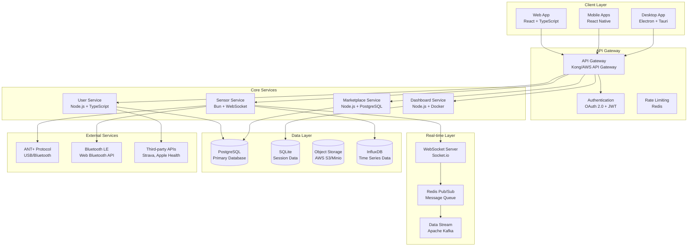

# UltiBiker Technical Architecture v1.1.0
*Complete System Design & Implementation Guide*

## 🏗️ System Architecture Overview



## 🔧 Technology Stack

### **Frontend Technologies**
```typescript
// Core Framework Stack
const frontendStack = {
  web: {
    framework: "React 18.x",
    language: "TypeScript 5.x",
    buildTool: "Vite 5.x",
    styling: "Tailwind CSS 3.x + Headless UI",
    stateManagement: "Zustand + React Query",
    routing: "React Router v6",
    testing: "Vitest + React Testing Library"
  },
  
  mobile: {
    framework: "React Native 0.73.x",
    navigation: "React Navigation v6",
    stateManagement: "Zustand + React Query",
    nativeModules: "Expo SDK 50.x",
    biometric: "expo-local-authentication",
    bluetooth: "@react-native-async-storage/async-storage"
  },
  
  desktop: {
    framework: "Tauri 2.x (Primary) / Electron (Fallback)",
    frontend: "Same React app as web",
    systemIntegration: "Tauri APIs for file system, notifications",
    updater: "Tauri built-in updater",
    packaging: "Cross-platform binary distribution"
  }
};
```

### **Backend Technologies**
```typescript
// Core Backend Stack
const backendStack = {
  runtime: "Bun 1.x (Primary) / Node.js 20.x (Compatibility)",
  language: "TypeScript 5.x",
  framework: "Hono (Fast, lightweight)",
  database: {
    primary: "PostgreSQL 16.x with Drizzle ORM",
    timeSeries: "InfluxDB 2.x for sensor data",
    cache: "Redis 7.x for sessions and real-time data",
    local: "SQLite with Drizzle for dashboard storage"
  },
  
  realTime: {
    websockets: "Socket.io 4.x",
    messageQueue: "Redis Pub/Sub",
    streaming: "Apache Kafka (for high-volume sensor data)"
  },
  
  authentication: {
    protocol: "OAuth 2.0 + OIDC",
    tokens: "JWT with RS256 signing",
    biometric: "WebAuthn standard",
    social: "OAuth providers (Google, Apple, GitHub, Microsoft)"
  },
  
  deployment: {
    containers: "Docker + Docker Compose",
    orchestration: "Kubernetes (production)",
    cicd: "GitHub Actions",
    monitoring: "Grafana + Prometheus"
  }
};
```

## 📊 Database Schema Design

### **PostgreSQL Schema (v1.1.0)**
```sql
-- Users and Authentication
CREATE TABLE users (
    id UUID PRIMARY KEY DEFAULT gen_random_uuid(),
    email VARCHAR(255) UNIQUE NOT NULL,
    name VARCHAR(255),
    avatar_url TEXT,
    timezone VARCHAR(50) DEFAULT 'UTC',
    created_at TIMESTAMP WITH TIME ZONE DEFAULT NOW(),
    updated_at TIMESTAMP WITH TIME ZONE DEFAULT NOW(),
    
    -- Preferences
    preferences JSONB DEFAULT '{}',
    privacy_settings JSONB DEFAULT '{"data_sharing": false, "analytics": true}',
    
    -- Account status
    email_verified BOOLEAN DEFAULT FALSE,
    account_status VARCHAR(20) DEFAULT 'active', -- active, suspended, deleted
    last_login_at TIMESTAMP WITH TIME ZONE,
    
    CONSTRAINT valid_email CHECK (email ~* '^[A-Za-z0-9._%+-]+@[A-Za-z0-9.-]+\.[A-Za-z]{2,}$')
);

-- Authentication Methods
CREATE TABLE user_authentication (
    id UUID PRIMARY KEY DEFAULT gen_random_uuid(),
    user_id UUID NOT NULL REFERENCES users(id) ON DELETE CASCADE,
    auth_type VARCHAR(50) NOT NULL, -- password, oauth, biometric, totp
    provider VARCHAR(50), -- google, apple, github, microsoft, local
    provider_user_id VARCHAR(255),
    credential_data JSONB, -- Encrypted credential storage
    is_primary BOOLEAN DEFAULT FALSE,
    is_active BOOLEAN DEFAULT TRUE,
    created_at TIMESTAMP WITH TIME ZONE DEFAULT NOW(),
    last_used_at TIMESTAMP WITH TIME ZONE,
    
    UNIQUE(provider, provider_user_id),
    UNIQUE(user_id, auth_type, provider)
);

-- Account Unification Tracking
CREATE TABLE account_merges (
    id UUID PRIMARY KEY DEFAULT gen_random_uuid(),
    primary_user_id UUID NOT NULL REFERENCES users(id),
    merged_user_id UUID NOT NULL,
    confidence_score DECIMAL(3,2) NOT NULL, -- 0.00 to 1.00
    matching_factors JSONB NOT NULL, -- Array of matching criteria
    user_decision VARCHAR(20) NOT NULL, -- confirmed, rejected, automatic
    merged_at TIMESTAMP WITH TIME ZONE DEFAULT NOW(),
    merged_by UUID REFERENCES users(id) -- Admin who approved if manual
);

-- Cycling Sessions
CREATE TABLE cycling_sessions (
    id UUID PRIMARY KEY DEFAULT gen_random_uuid(),
    user_id UUID NOT NULL REFERENCES users(id) ON DELETE CASCADE,
    name VARCHAR(255),
    description TEXT,
    
    -- Session timing
    started_at TIMESTAMP WITH TIME ZONE NOT NULL,
    ended_at TIMESTAMP WITH TIME ZONE,
    duration_seconds INTEGER, -- Calculated field
    timezone VARCHAR(50),
    
    -- Session data
    total_distance_meters DECIMAL(10,2),
    total_elevation_gain_meters DECIMAL(8,2),
    average_speed_mps DECIMAL(6,3), -- meters per second
    max_speed_mps DECIMAL(6,3),
    
    -- Power data (if available)
    average_power_watts INTEGER,
    max_power_watts INTEGER,
    normalized_power_watts INTEGER,
    training_stress_score DECIMAL(5,1),
    intensity_factor DECIMAL(3,2),
    
    -- Heart rate data (if available)
    average_heart_rate_bpm INTEGER,
    max_heart_rate_bpm INTEGER,
    
    -- Cadence data (if available)
    average_cadence_rpm INTEGER,
    
    -- Session metadata
    session_type VARCHAR(50) DEFAULT 'outdoor', -- outdoor, indoor, virtual
    weather_conditions JSONB, -- Temperature, wind, precipitation
    equipment_used JSONB, -- Bike, wheels, etc.
    route_data JSONB, -- GPS coordinates if available
    
    -- Analysis data
    power_zones_distribution JSONB, -- Time in each zone
    heart_rate_zones_distribution JSONB,
    effort_analysis JSONB, -- Peak efforts, intervals detected
    
    created_at TIMESTAMP WITH TIME ZONE DEFAULT NOW(),
    updated_at TIMESTAMP WITH TIME ZONE DEFAULT NOW()
);

-- Real-time Sensor Data (InfluxDB schema would be different)
-- This table is for session-related sensor metadata only
CREATE TABLE sensor_configurations (
    id UUID PRIMARY KEY DEFAULT gen_random_uuid(),
    user_id UUID NOT NULL REFERENCES users(id) ON DELETE CASCADE,
    device_name VARCHAR(255) NOT NULL,
    device_type VARCHAR(50) NOT NULL, -- heart_rate, power, cadence, speed
    device_manufacturer VARCHAR(100),
    device_model VARCHAR(100),
    device_serial VARCHAR(100),
    
    -- Connection details
    connection_type VARCHAR(20) NOT NULL, -- ant_plus, bluetooth_le
    device_id VARCHAR(100), -- ANT+ device ID or BLE MAC
    
    -- Configuration
    is_primary BOOLEAN DEFAULT TRUE, -- Primary device for this sensor type
    calibration_data JSONB, -- Device-specific calibration
    battery_level INTEGER, -- Last known battery level (0-100)
    signal_strength INTEGER, -- Last known signal strength
    
    -- Status
    is_active BOOLEAN DEFAULT TRUE,
    last_connected_at TIMESTAMP WITH TIME ZONE,
    firmware_version VARCHAR(50),
    
    created_at TIMESTAMP WITH TIME ZONE DEFAULT NOW(),
    updated_at TIMESTAMP WITH TIME ZONE DEFAULT NOW(),
    
    UNIQUE(user_id, device_type, device_id)
);

-- Dashboard Management
CREATE TABLE user_dashboards (
    id UUID PRIMARY KEY DEFAULT gen_random_uuid(),
    user_id UUID NOT NULL REFERENCES users(id) ON DELETE CASCADE,
    dashboard_id UUID NOT NULL REFERENCES marketplace_dashboards(id),
    
    -- Installation details
    installed_at TIMESTAMP WITH TIME ZONE DEFAULT NOW(),
    is_active BOOLEAN DEFAULT FALSE,
    is_pinned BOOLEAN DEFAULT FALSE,
    
    -- User customization
    custom_settings JSONB DEFAULT '{}',
    layout_preferences JSONB DEFAULT '{}',
    
    -- Usage tracking
    last_used_at TIMESTAMP WITH TIME ZONE,
    usage_count INTEGER DEFAULT 0,
    
    UNIQUE(user_id, dashboard_id)
);

-- Marketplace Dashboards
CREATE TABLE marketplace_dashboards (
    id UUID PRIMARY KEY DEFAULT gen_random_uuid(),
    developer_id UUID NOT NULL REFERENCES developers(id),
    
    -- Basic info
    name VARCHAR(255) NOT NULL,
    description TEXT,
    version VARCHAR(20) NOT NULL, -- Semantic versioning
    category VARCHAR(50) NOT NULL,
    
    -- Content
    manifest_data JSONB NOT NULL, -- Dashboard configuration
    code_bundle_url TEXT, -- S3 URL to code bundle
    screenshot_urls TEXT[], -- Array of screenshot URLs
    icon_url TEXT,
    
    -- Status
    publication_status VARCHAR(20) DEFAULT 'draft', -- draft, pending, published, rejected, suspended
    review_status VARCHAR(20) DEFAULT 'pending', -- pending, in_review, approved, rejected
    review_notes TEXT,
    reviewed_by UUID REFERENCES users(id), -- Admin who reviewed
    reviewed_at TIMESTAMP WITH TIME ZONE,
    
    -- Metrics
    install_count INTEGER DEFAULT 0,
    rating_average DECIMAL(2,1) DEFAULT 0.0,
    rating_count INTEGER DEFAULT 0,
    
    -- Security
    security_scan_status VARCHAR(20) DEFAULT 'pending', -- pending, passed, failed
    security_scan_results JSONB,
    last_scanned_at TIMESTAMP WITH TIME ZONE,
    
    created_at TIMESTAMP WITH TIME ZONE DEFAULT NOW(),
    updated_at TIMESTAMP WITH TIME ZONE DEFAULT NOW(),
    published_at TIMESTAMP WITH TIME ZONE
);

-- Developer Accounts
CREATE TABLE developers (
    id UUID PRIMARY KEY DEFAULT gen_random_uuid(),
    user_id UUID NOT NULL REFERENCES users(id) ON DELETE CASCADE,
    
    -- Developer info
    display_name VARCHAR(255) NOT NULL,
    company_name VARCHAR(255),
    website_url TEXT,
    support_email VARCHAR(255),
    
    -- Verification
    verification_status VARCHAR(20) DEFAULT 'unverified', -- unverified, pending, verified
    verification_documents JSONB, -- Stored document references
    verified_at TIMESTAMP WITH TIME ZONE,
    verified_by UUID REFERENCES users(id),
    
    -- Developer tier
    tier VARCHAR(20) DEFAULT 'community', -- community, verified, premium, partner
    tier_benefits JSONB DEFAULT '{}',
    
    -- API access
    api_key_hash VARCHAR(255), -- Hashed API key
    rate_limit_tier VARCHAR(20) DEFAULT 'standard',
    
    created_at TIMESTAMP WITH TIME ZONE DEFAULT NOW(),
    updated_at TIMESTAMP WITH TIME ZONE DEFAULT NOW()
);

-- Create indexes for performance
CREATE INDEX idx_users_email ON users(email);
CREATE INDEX idx_users_created_at ON users(created_at);

CREATE INDEX idx_user_auth_user_id ON user_authentication(user_id);
CREATE INDEX idx_user_auth_provider ON user_authentication(provider, provider_user_id);

CREATE INDEX idx_sessions_user_id ON cycling_sessions(user_id);
CREATE INDEX idx_sessions_started_at ON cycling_sessions(started_at);
CREATE INDEX idx_sessions_user_started ON cycling_sessions(user_id, started_at);

CREATE INDEX idx_sensors_user_id ON sensor_configurations(user_id);
CREATE INDEX idx_sensors_device_type ON sensor_configurations(user_id, device_type);
CREATE INDEX idx_sensors_active ON sensor_configurations(user_id, is_active);

CREATE INDEX idx_user_dashboards_user_id ON user_dashboards(user_id);
CREATE INDEX idx_user_dashboards_active ON user_dashboards(user_id, is_active);

CREATE INDEX idx_marketplace_status ON marketplace_dashboards(publication_status);
CREATE INDEX idx_marketplace_category ON marketplace_dashboards(category);
CREATE INDEX idx_marketplace_rating ON marketplace_dashboards(rating_average);

-- Create triggers for updated_at timestamps
CREATE OR REPLACE FUNCTION update_updated_at_column()
RETURNS TRIGGER AS $$
BEGIN
    NEW.updated_at = NOW();
    RETURN NEW;
END;
$$ language 'plpgsql';

CREATE TRIGGER update_users_updated_at BEFORE UPDATE ON users
    FOR EACH ROW EXECUTE FUNCTION update_updated_at_column();

CREATE TRIGGER update_sessions_updated_at BEFORE UPDATE ON cycling_sessions
    FOR EACH ROW EXECUTE FUNCTION update_updated_at_column();

CREATE TRIGGER update_sensors_updated_at BEFORE UPDATE ON sensor_configurations
    FOR EACH ROW EXECUTE FUNCTION update_updated_at_column();

CREATE TRIGGER update_dashboards_updated_at BEFORE UPDATE ON marketplace_dashboards
    FOR EACH ROW EXECUTE FUNCTION update_updated_at_column();

CREATE TRIGGER update_developers_updated_at BEFORE UPDATE ON developers
    FOR EACH ROW EXECUTE FUNCTION update_updated_at_column();
```

## 🔌 Real-time Data Architecture

### **Sensor Data Pipeline**
```typescript
// Real-time Sensor Data Processing Pipeline
export class SensorDataPipeline {
  private influxDB: InfluxDB;
  private redis: Redis;
  private kafka: Kafka;
  
  constructor() {
    this.influxDB = new InfluxDB({
      url: process.env.INFLUXDB_URL,
      token: process.env.INFLUXDB_TOKEN,
      org: 'ultibiker',
      bucket: 'sensor-data'
    });
    
    this.redis = new Redis(process.env.REDIS_URL);
    
    this.kafka = kafka({
      clientId: 'ultibiker-sensor-processor',
      brokers: [process.env.KAFKA_BROKER]
    });
  }
  
  // Receive sensor data from devices
  async processSensorReading(reading: SensorReading): Promise<void> {
    // Validate and sanitize data
    const validatedReading = await this.validateSensorData(reading);
    
    // Store in time-series database (InfluxDB)
    await this.storeTimeSeriesData(validatedReading);
    
    // Cache latest reading for real-time display
    await this.cacheLatestReading(validatedReading);
    
    // Publish to real-time subscribers
    await this.publishToSubscribers(validatedReading);
    
    // Queue for batch processing
    await this.queueForAnalysis(validatedReading);
  }
  
  private async storeTimeSeriesData(reading: SensorReading): Promise<void> {
    const point = new Point('sensor_reading')
      .tag('user_id', reading.userId)
      .tag('session_id', reading.sessionId)
      .tag('sensor_type', reading.sensorType)
      .tag('device_id', reading.deviceId)
      .floatField('value', reading.value)
      .floatField('quality_score', reading.qualityScore || 100)
      .timestamp(new Date(reading.timestamp));
    
    await this.influxDB.getWriteApi().writePoint(point);
  }
  
  private async cacheLatestReading(reading: SensorReading): Promise<void> {
    const key = `latest:${reading.userId}:${reading.sensorType}:${reading.deviceId}`;
    await this.redis.setex(key, 300, JSON.stringify(reading)); // 5 minute expiry
  }
  
  private async publishToSubscribers(reading: SensorReading): Promise<void> {
    // Publish to Redis for WebSocket distribution
    await this.redis.publish(
      `sensor:${reading.userId}:${reading.sessionId}`,
      JSON.stringify(reading)
    );
  }
}

// InfluxDB Schema for Sensor Data
interface SensorReading {
  timestamp: string; // ISO 8601
  userId: string;
  sessionId: string;
  sensorType: 'heart_rate' | 'power' | 'cadence' | 'speed' | 'temperature';
  deviceId: string;
  value: number;
  unit: string;
  qualityScore?: number; // 0-100
  metadata?: {
    batteryLevel?: number;
    signalStrength?: number;
    calibrationStatus?: string;
  };
}
```

## 🛡️ Security Architecture

### **Authentication Flow**
```typescript
// Multi-factor Authentication Implementation
export class AuthenticationService {
  private jwtService: JWTService;
  private biometricService: BiometricService;
  private totpService: TOTPService;
  
  async authenticateUser(request: AuthRequest): Promise<AuthResult> {
    switch (request.method) {
      case 'biometric':
        return await this.authenticateBiometric(request);
      case 'oauth':
        return await this.authenticateOAuth(request);
      case 'password':
        return await this.authenticatePassword(request);
      case 'mfa':
        return await this.authenticateMFA(request);
    }
  }
  
  private async authenticateBiometric(request: BiometricRequest): Promise<AuthResult> {
    // Verify WebAuthn assertion
    const verification = await this.biometricService.verifyAssertion({
      credentialId: request.credentialId,
      authenticatorData: request.authenticatorData,
      clientDataJSON: request.clientDataJSON,
      signature: request.signature,
      userHandle: request.userHandle
    });
    
    if (!verification.verified) {
      throw new AuthenticationError('Biometric verification failed');
    }
    
    // Get user from credential
    const user = await this.getUserByCredentialId(request.credentialId);
    
    // Generate session tokens
    return await this.generateAuthResult(user, 'biometric');
  }
  
  private async authenticateOAuth(request: OAuthRequest): Promise<AuthResult> {
    // Verify OAuth provider token
    const providerUser = await this.verifyProviderToken(
      request.provider,
      request.accessToken
    );
    
    // Find or create user
    let user = await this.findUserByProviderInfo(
      request.provider,
      providerUser.id
    );
    
    if (!user) {
      // Check for potential account matches
      const matches = await this.identityMatcher.findPotentialMatches({
        email: providerUser.email,
        name: providerUser.name,
        provider: request.provider,
        providerId: providerUser.id
      });
      
      if (matches.length > 0 && matches[0].confidence > 0.8) {
        // High confidence match - present to user for confirmation
        return {
          status: 'account_match_found',
          matchingAccount: this.sanitizeUserData(matches[0].existingUser),
          confidence: matches[0].confidence,
          tempToken: await this.generateTempToken(providerUser)
        };
      }
      
      // Create new user
      user = await this.createUserFromProvider(request.provider, providerUser);
    }
    
    return await this.generateAuthResult(user, 'oauth', request.provider);
  }
  
  private async generateAuthResult(
    user: User, 
    method: string, 
    provider?: string
  ): Promise<AuthResult> {
    // Generate JWT tokens
    const accessToken = await this.jwtService.signAccessToken({
      sub: user.id,
      email: user.email,
      name: user.name,
      method: method,
      provider: provider,
      iat: Math.floor(Date.now() / 1000),
      exp: Math.floor(Date.now() / 1000) + (15 * 60) // 15 minutes
    });
    
    const refreshToken = await this.jwtService.signRefreshToken({
      sub: user.id,
      type: 'refresh',
      iat: Math.floor(Date.now() / 1000),
      exp: Math.floor(Date.now() / 1000) + (30 * 24 * 60 * 60) // 30 days
    });
    
    // Store session in Redis
    await this.storeSession(user.id, {
      method: method,
      provider: provider,
      createdAt: new Date(),
      expiresAt: new Date(Date.now() + (30 * 24 * 60 * 60 * 1000))
    });
    
    return {
      status: 'success',
      user: this.sanitizeUserData(user),
      tokens: {
        accessToken,
        refreshToken,
        expiresIn: 900 // 15 minutes in seconds
      }
    };
  }
}
```

## 🚀 Performance Optimization

### **Caching Strategy**
```typescript
// Multi-layer Caching Architecture
export class CacheManager {
  private l1Cache: Map<string, any> = new Map(); // In-memory
  private l2Cache: Redis; // Distributed cache
  private l3Cache: PostgreSQL; // Database cache
  
  async get<T>(key: string, fallback?: () => Promise<T>): Promise<T | null> {
    // L1: Check memory cache first (fastest)
    if (this.l1Cache.has(key)) {
      return this.l1Cache.get(key);
    }
    
    // L2: Check Redis cache
    const cached = await this.l2Cache.get(key);
    if (cached) {
      const parsed = JSON.parse(cached);
      this.l1Cache.set(key, parsed); // Populate L1
      return parsed;
    }
    
    // L3: Fallback to database or computation
    if (fallback) {
      const result = await fallback();
      await this.set(key, result, 300); // Cache for 5 minutes
      return result;
    }
    
    return null;
  }
  
  async set(key: string, value: any, ttl: number = 3600): Promise<void> {
    // Store in all cache layers
    this.l1Cache.set(key, value);
    await this.l2Cache.setex(key, ttl, JSON.stringify(value));
  }
  
  // Cache invalidation strategies
  async invalidatePattern(pattern: string): Promise<void> {
    // Invalidate L1 cache
    for (const key of this.l1Cache.keys()) {
      if (this.matchesPattern(key, pattern)) {
        this.l1Cache.delete(key);
      }
    }
    
    // Invalidate L2 cache
    const keys = await this.l2Cache.keys(pattern);
    if (keys.length > 0) {
      await this.l2Cache.del(...keys);
    }
  }
}

// Database Query Optimization
export class QueryOptimizer {
  // Optimized query for dashboard data
  async getDashboardData(userId: string, timeRange: TimeRange): Promise<DashboardData> {
    // Use prepared statements and proper indexing
    const query = `
      WITH recent_sessions AS (
        SELECT * FROM cycling_sessions 
        WHERE user_id = $1 
          AND started_at >= $2 
          AND started_at <= $3
        ORDER BY started_at DESC
        LIMIT 100
      ),
      sensor_summary AS (
        SELECT 
          device_type,
          COUNT(*) as session_count,
          AVG(CASE WHEN device_type = 'power' THEN average_power_watts END) as avg_power,
          AVG(CASE WHEN device_type = 'heart_rate' THEN average_heart_rate_bpm END) as avg_hr
        FROM recent_sessions rs
        JOIN sensor_configurations sc ON sc.user_id = rs.user_id
        GROUP BY device_type
      )
      SELECT 
        rs.*,
        ss.avg_power,
        ss.avg_hr
      FROM recent_sessions rs
      CROSS JOIN sensor_summary ss;
    `;
    
    return await this.database.query(query, [userId, timeRange.start, timeRange.end]);
  }
}
```

This technical architecture provides a solid foundation for the UltiBiker platform with proper separation of concerns, security-first design, and scalability considerations.